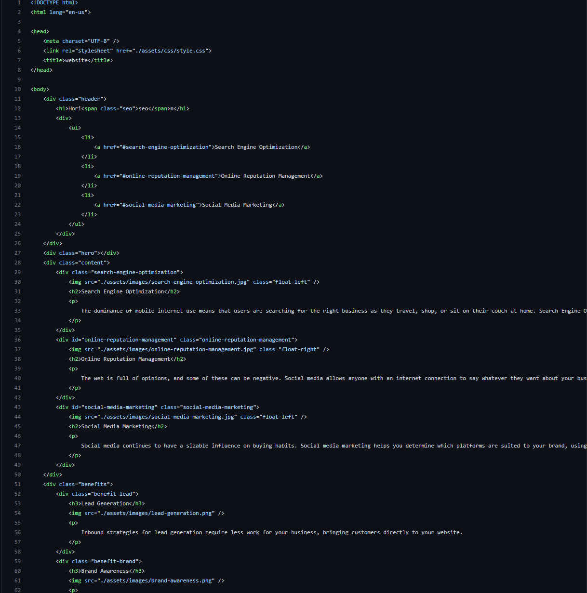
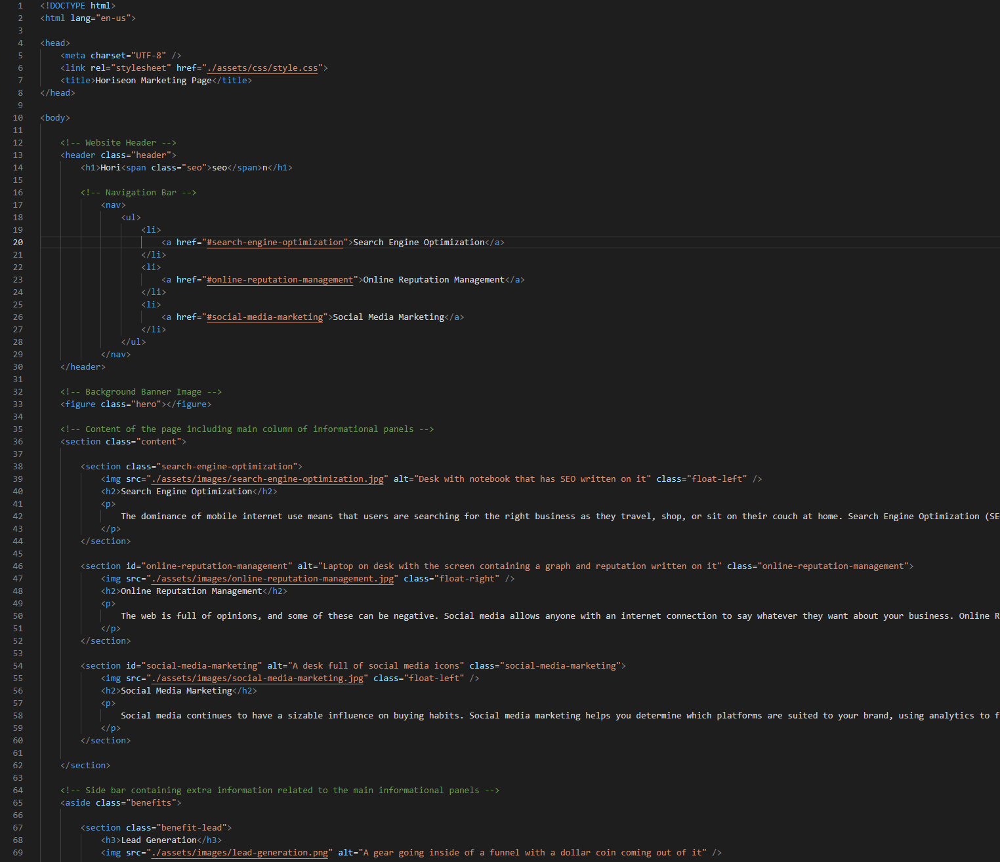

# Module-1-Refactor-Challenge

This repository is my first challenge of many to complete within the UofT coding bootcamp I'm taking part of. 
The assignment is to refactor existing code to meet the assignment's Acceptance Criteria.
The first part of this is the User Story which is as follows:

## User Story

AS A marketing agency
I WANT a codebase that follows accessibility standards
SO THAT our own site is optimized for search engines

## Acceptance Criteria

The Acceptance Criteria is as follows:

GIVEN a webpage meets accessibility standards
WHEN I view the source code
THEN I find semantic HTML elements
WHEN I view the structure of the HTML elements
THEN I find that the elements follow a logical structure independent of styling and positioning
WHEN I view the image elements
THEN I find accessible alt attributes
WHEN I view the heading attributes
THEN they fall in sequential order
WHEN I view the title element
THEN I find a concise, descriptive title

## To Put It Simply

The assignment is to turn the original code which looks something like this (notice all the div tags):

Into something more like this (notice the lack of div tags):

## Link To Deployed Application
https://benbasic.github.io/Module-1-Refactor-Challenge/

